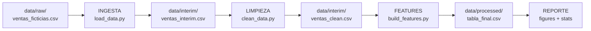

# Pipeline ETL - Ingeniería de Datos

Pipeline ETL modular para análisis de ventas, construido con Python siguiendo la estructura de **cookiecutter-data-science**.

## Arquitectura del Pipeline



## Estructura del Proyecto

```
proyecto_ingenieria_datos/
├── data/
│   ├── raw/           ← datos originales (NO modificar)
│   ├── interim/       ← transformaciones intermedias
│   ├── processed/     ← tabla_final.csv (salida del pipeline)
│   └── external/      ← APIs y datos externos
├── notebooks/         ← EDA y documentación exploratoria
├── src/               ← código fuente modular
│   ├── config.py      ← rutas centralizadas y .env
│   ├── dataset.py     ← lectura/escritura de DataFrames
│   ├── plots.py       ← generación de figuras
│   ├── ingestion/     ← load_data.py
│   ├── preprocessing/ ← clean_data.py
│   ├── features/      ← build_features.py
│   ├── llm/           ← llm_connector.py
│   └── pipeline/      ← main.py (orquestador)
├── models/
├── reports/
├── tests/             ← pytest
├── .env.example
├── Makefile
├── pyproject.toml
└── requirements.txt
```

## Instalación (WSL2 / Linux / macOS)

```bash
# 1. Clonar el repositorio
git clone https://github.com/tu-usuario/proyecto_ingenieria_datos.git
cd proyecto_ingenieria_datos

# 2. Crear entorno virtual aislado
python3 -m venv venv
source venv/bin/activate

# 3. Instalar dependencias
pip install -r requirements.txt

# 4. Configurar variables de entorno
cp .env.example .env
# Editar .env con tus API keys
```

## Ejecución del Pipeline

```bash
# Pipeline completo (recomendado para sustentación)
python src/pipeline/main.py --mode full

# Pasos individuales
python src/pipeline/main.py --mode ingest
python src/pipeline/main.py --mode clean
python src/pipeline/main.py --mode features
python src/pipeline/main.py --mode report

# Con Makefile
make run
make ingest
make test
```

## Verificación de Artefactos

```bash
ls -lh data/processed/
head data/processed/tabla_final.csv
wc -l data/processed/tabla_final.csv
```

## Tests

```bash
pytest tests/ -v
```

## Transformaciones del Pipeline

| Paso | Módulo | Acción |
|------|--------|--------|
| 1 - Ingesta | `ingestion/load_data.py` | Lee CSV crudo, guarda en interim |
| 2 - Limpieza | `preprocessing/clean_data.py` | Elimina nulos, cantidades negativas, normaliza texto y fechas |
| 3 - Features | `features/build_features.py` | Crea total_venta, variables temporales, segmento_precio |
| 4 - Reporte | `pipeline/main.py` | Estadísticas y figuras en reports/figures/ |

## Equipo

- Persona 1 - Ingesta y Configuración
- Persona 2 - Preprocesamiento y Features
- Persona 3 - Pipeline y Tests
