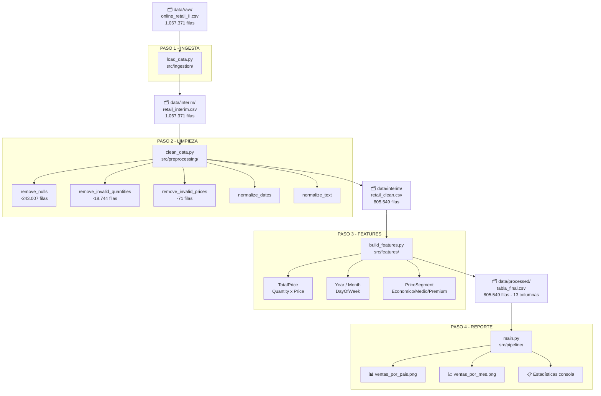
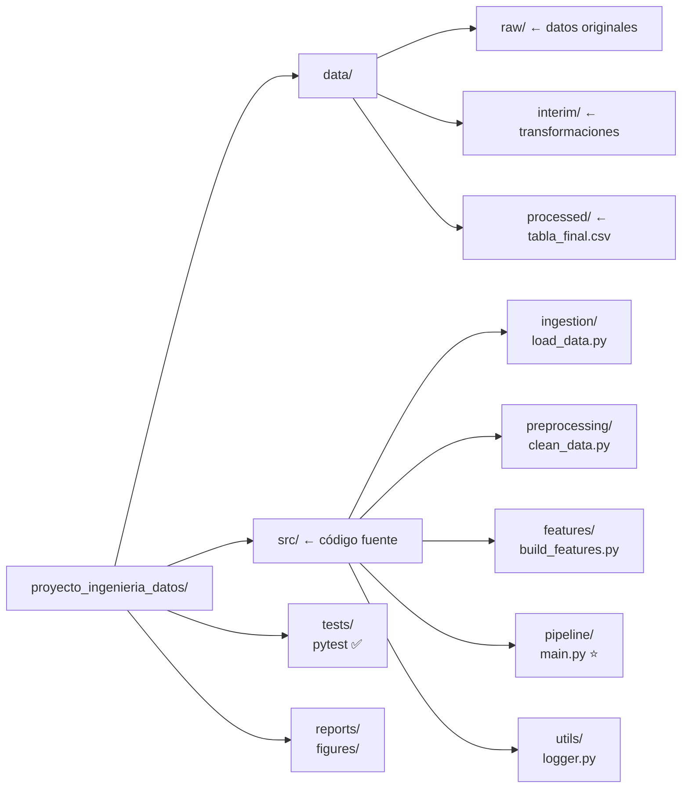
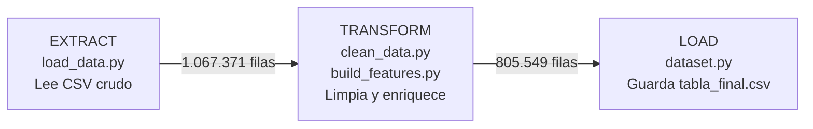
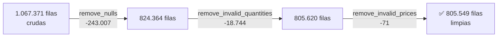
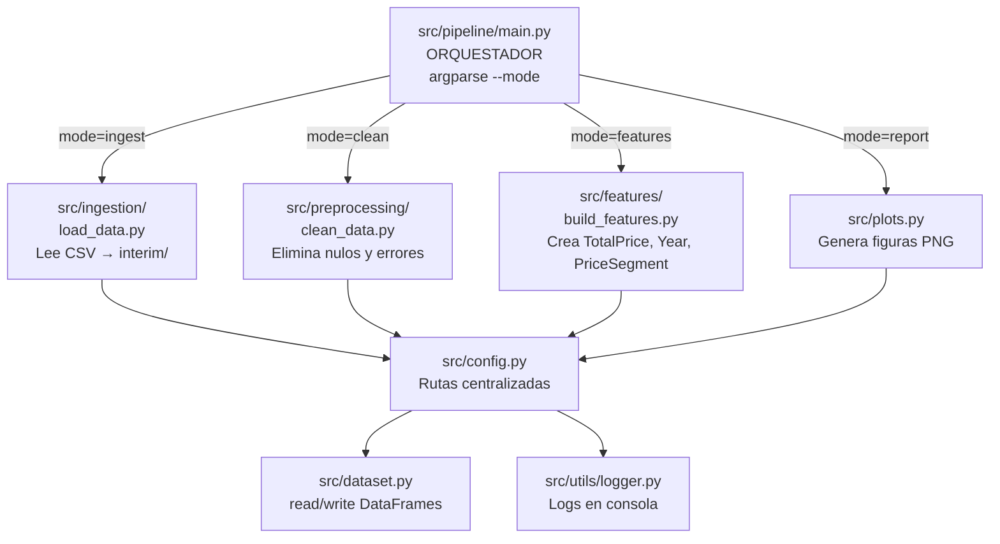

# Pipeline ETL - Online Retail II

Pipeline ETL modular para análisis de ventas con +1 millón de registros.

---

## Arquitectura General del Pipeline


---

## Estructura del Proyecto


---

## Flujo de Datos - ETL


---

## Calidad de Datos


---

## Módulos y Responsabilidades


---

## Comandos de Ejecución
```bash
# Pipeline completo
python src/pipeline/main.py --mode full

# Pasos individuales
python src/pipeline/main.py --mode ingest
python src/pipeline/main.py --mode clean
python src/pipeline/main.py --mode features
python src/pipeline/main.py --mode report

# Tests
pytest tests/ -v

# Ver estructura
tree -a --dirsfirst -I '__pycache__|.ipynb_checkpoints|venv|*.egg-info'
```

---

## Resultados del Pipeline

| Métrica | Valor |
|---|---|
| Filas cargadas | 1.067.371 |
| Filas después de limpieza | 805.549 |
| Columnas finales | 13 |
| Total ventas | $17.743.429,18 |
| País top | United Kingdom |
| Producto top | Regency Cakestand 3 Tier |

---
